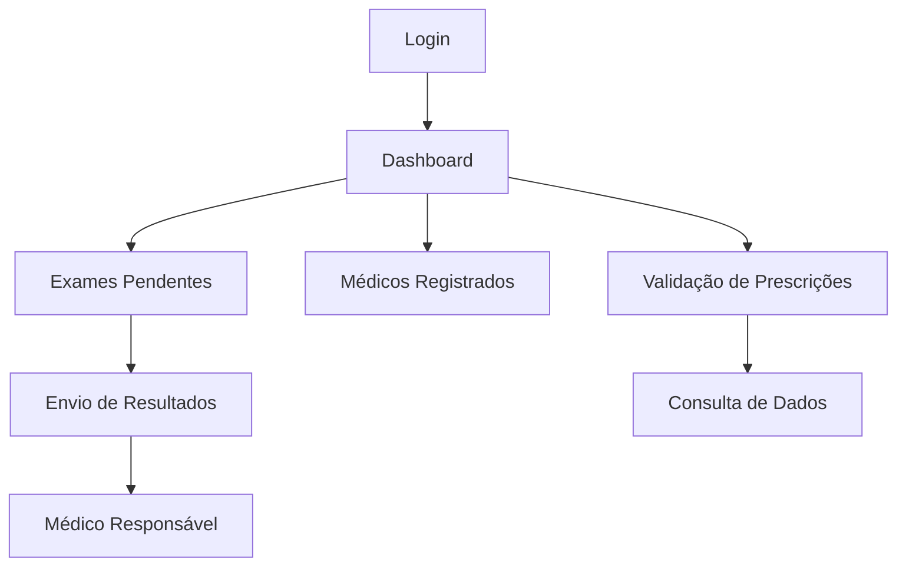

# 🧪 ZaMed - Área Laboratorial

> Plataforma web para gerenciamento de exames laboratoriais, prescrições médicas e acompanhamento operacional de laboratórios.

[]()
[]()
[]()
[]()
[]()

---

## 📖 Sobre o Projeto

A Área Laboratorial da ZaMed foi desenvolvida para centralizar o fluxo operacional entre laboratórios e profissionais da saúde.

A plataforma permite:

* Autenticação de usuários
* Controle de exames pendentes
* Gerenciamento de médicos cadastrados
* Envio de resultados laboratoriais
* Verificação de prescrições médicas
* Dashboard operacional com indicadores

O sistema foi projetado para simplificar a comunicação entre laboratórios e médicos, reduzindo processos manuais e aumentando a rastreabilidade das informações.

---

## ✨ Funcionalidades

### 🔐 Autenticação

* Login seguro
* Controle de sessão
* Rotas protegidas

### 📊 Dashboard

Visualização rápida de indicadores importantes:

* Exames pendentes
* Prescrições recebidas
* Exames realizados no dia
* Quantidade de pacientes atendidos

### 📋 Exames Pendentes

Permite visualizar exames aguardando processamento e identificar rapidamente os responsáveis.

### 👨‍⚕️ Médicos Registrados

Consulta da lista de médicos cadastrados no sistema com seus respectivos registros profissionais.

### 📤 Envio de Resultados

Fluxo para envio de resultados laboratoriais aos médicos responsáveis.

### ✅ Verificação de Prescrições

Validação e consulta de prescrições através de identificadores únicos.

---

## 🏗️ Arquitetura



---

## 🖥️ Telas do Sistema

### Login

* Autenticação via CPF e senha
* Controle de acesso

### Dashboard

* Resumo operacional
* Indicadores em tempo real

### Exames Pendentes

* Lista de exames aguardando processamento
* Acesso rápido aos pacientes

### Médicos Registrados

* Consulta de profissionais cadastrados
* Busca de registros médicos

### Envio de Resultados

* Envio de exames aos médicos responsáveis

### Verificação de Prescrições

* Consulta e validação de prescrições

---

## ⚙️ Tecnologias Utilizadas

| Categoria               | Tecnologia       |
| ----------------------- | ---------------- |
| Front-end               | React            |
| Build Tool              | Vite             |
| Estilização             | Tailwind CSS     |
| Gerenciamento de Estado | React Context    |
| Data Fetching           | TanStack Query   |
| Roteamento              | React Router DOM |
| Mock API                | MirageJS         |
| Ícones                  | Lucide React     |
| UI Components           | Material UI      |

---

## 📂 Estrutura do Projeto

```text
src/
├── pages/
│   ├── Login.jsx
│   ├── Dashboard.jsx
│   ├── ExamesPendentes.jsx
│   ├── MedicosRegistrados.jsx
│   ├── EnvioR.jsx
│   └── PrescriptionVerification.jsx
│
├── components/
│
├── contexts/
│
├── App.jsx
├── main.jsx
└── index.css
```

---

## 🚀 Instalação

Clone o repositório:

```bash
git clone https://github.com/gi44n/Zamed_areaLab.git
cd Zamed_areaLab
```

Instale as dependências:

```bash
npm install
```

ou

```bash
yarn
```

---

## ▶️ Executando o Projeto

```bash
npm run dev
```

A aplicação ficará disponível em:

```text
http://localhost:5173
```

---

## 📈 Próximas Evoluções

* Integração com banco de dados real
* Integração com APIs hospitalares
* Upload de exames em PDF
* Assinatura digital de resultados
* Dashboard analítico avançado
* Notificações em tempo real
* Integração com prontuários eletrônicos

---

## 👨‍💻 Autor

### Gian Lima

Full Stack Developer | AI & Automation

Projeto desenvolvido como parte da plataforma ZaMed, focada na transformação digital da área da saúde.

---

⭐ Caso tenha gostado do projeto, deixe uma estrela no repositório.
